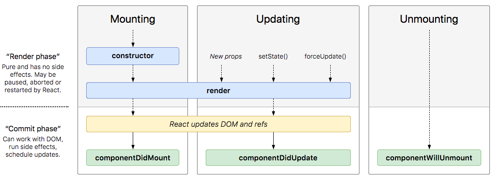

Is developing mobile apps is too hard and you can’t understand?

Here comes **React Native** with a much more easy way to build native mobile apps for iOS and Android. Facebook themselves are using React Native for their apps like Facebook, Instagram, Facebook Analytics and more.

Even some companies like Uber, Wix.com, Pinterest, and Skype are using React Native for developing their apps in both iOS and Android.

Let’s get to know React Native on the Technical side…

**React Native** is a JavaScript framework developed by Facebook for writing real, natively rendering mobile applications for iOS and Android. React Native uses ReactJs in Javascript platform. React Native also have inbuilt APIs like Dimensions and PermissionsAndroid to access the phone’s basic capabilities like a native app. Here we will see some basics about React Native. Before we get to that, one should know about JavaScript (ES6) and ReactJS.

###JSX
JSX is a syntax extension to Javascript. Its basically assigning HTML tags to a javascript variable for rendering the UI. As React does not use and HTML files it uses JSX where every component returns an HTML element. Even-though JSX is used for UI it comes with the full might of Javascript. An Example of JSX,

```js
const htmlElement = <h1>Matheswaaran</h1>;
```

###ReactJs

ReactJs is a Javascript framework by Facebook. React is a component-based framework, where each component is rendered using JSX (by returning a single HTML Tag with any number of children).

**Components** — The UI is broken into smaller parts called components which can be reused several times. Each component has props and state.

**Props** — When a component is created it can be customized based on some parameters that are passed to it. These parameters are called “Props” and are sent by the parent component.

**State** — The props of the component is fixed so we have to use the state for data that has to change inside a component. The state is initialized in the constructor of a component.

The lifecycle of a react component is explained in the below diagram.



**constructor()** — Invoked at first whenever a component is created. The state of a component will be declared and defined here.

**render()** — This function returns the view of the component. It can return only one element with any number of children. Also invoked every time the state is changed with setState() function

**componentDidMount()** — Invoked whenever a component is finished mounting.

**componentWillUnmount()** — Invoked before a component is about to be removed or unmounted.

**componentDidUpdate()** — Invoked whenever a component receives new props or the props changes. The newer props and the older ones are compared and based on the result the component is updated.

**setState()** — Updates the state of the components and re-renders the components with the updated state. Never assign values directly to state always use setState().

**forceUpdate()** — Invoked by the user when he wants to re-render the component based on other data (not state or props).

The detailed explanation of the lifecycle methods can be found here.

A typical component with state and props will be written as class component like,

```jsx
import React form 'react';
import { View, Text } from 'react-native';

class HelloWorld extends React.Component{
  constructor(props){
    super(props);
    this.state = { key: "value" }
  }
  
  render(){
    return(
      <View>
        <Text>Hello world!</Text>
      </View>
    );
  }
}
```

If a component does not need a state and it is used only to render a static data then it can be written as a functional component.

```jsx
import React form 'react';
import { View, Text } from 'react-native';

function HelloWorld(props){
  return(
    <View>
      <Text>Hello world!</Text>
    </View>
  );
}
```

To know about basic project environment setup, see my next post.

Say Hi, Its free. Tweet to me at [@matheswaaran_S](https://twitter.com/matheswaaran_S) or get ot know me at [https://matheswaaran.com](https://matheswaaran.com).
