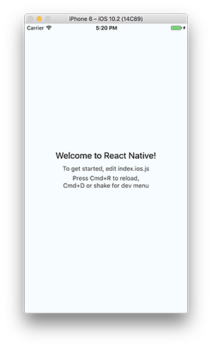

To know the basics about React Native, React and JSX see my previous post below.

A react native environment can be setup up in following 5 simple steps. Execute the steps based on your platforms (Windows, Linux, and Mac).

##Step 1 — Install NodeJs and react-native-cli

Download and install NodeJs for all platforms here — https://nodejs.org/en

[react-native-cli](https://www.npmjs.com/package/react-native-cli) is a node package used to create an empty react native app. We have to install the react-native-cli using “npm” globally for the system. To do so execute the following commands.

####Linux and Mac
After installing NodeJs open the terminal and type this command in Mac and Linux to install react-native-cli.

```bash
sudo npm install -g react-native-cli
```

> **Note**: Give your account login password when “sudo” is used in a command.

####Windows
Open the command prompt as administrator and run the following command to install react-native-cli.

```console
npm install -g react-native-cli
```

##Step 2 — Installing dependencies for Android

Download and install the Android Studio here. Make sure you have installed the SDK with SDK Manager.

After Installing the Android studio, go to SDK Manager which is available at “Settings → Appearance & Behaviour → System Settings → Android SDK” and make sure the following packages are checked.

- Android SDK
- Android SDK Platform
- Performance (Intel ® HAXM)
- Android Virtual Device

and also you will need some base packages and platforms so check these items too and click the “Apply” button.

- Android SDK Platform 27
- Google APIs Intel x86 Atom_64 System Image
- Next, select the “SDK Tools” tab and check the box next to “Show Package Details” here as well. Look for and expand the “Android SDK Build-Tools” entry, then make sure that 26.0.3 is selected.

Now add the path variables to start an emulator based on your platform.

####Mac

Edit the .bash_profile file in the Home Directory of the user. You can open it by executing the following command in the terminal.

```bash
open $HOME/.bash_profile
```

Add the following lines at the end of the file.

```bash
export ANDROID_HOME=$HOME/Library/Android/sdk 
export PATH=$PATH:$ANDROID_HOME/emulator 
export PATH=$PATH:$ANDROID_HOME/tools 
export PATH=$PATH:$ANDROID_HOME/tools/bin 
export PATH=$PATH:$ANDROID_HOME/platform-tools
```

####Linux
Edit the .bash_profile file in the Home Directory of the user. You can open it by executing the following command in the terminal.

```bash
gedit $HOME/.bash_profile
```

Add the following lines at the end of the file.

```bash
export ANDROID_HOME=$HOME/Android/Sdk 
export PATH=$PATH:$ANDROID_HOME/emulator 
export PATH=$PATH:$ANDROID_HOME/tools 
export PATH=$PATH:$ANDROID_HOME/tools/bin 
export PATH=$PATH:$ANDROID_HOME/platform-tools
```

####Windows
In windows, you have to add your SDK path to Environmental Variables. Set the variable name to ANDROID_HOME and variable value to,

```console
C:\Users\your_username\AppData\Local\Android\Sdk
```
> **Note**: set the "your_username" to your own username of the system.


##Step 3 — Installing dependencies for iOS
####Mac
For developing iOS Apps you need Xcode and it can be downloaded from https://itunes.apple.com/in/app/xcode/id497799835.

####Linux and Windows
The iOS app development requires Xcode and it is not available for Linux and Windows. So, these platforms are not supported right now.

##Step 4 — Creating a React Native App
The environment setup is complete. Now let’s try creating a react native app.

Go to the terminal(Linux and Mac) or the Command Prompt(Windows) and type the following command to create an empty react native project.

```bash
react-native init YourAwesomeProject
```
> **Note**: Replace "YourAwesomeProject" with your project name

##Step 5 — Running Your Awesome App
You can deploy the created app in development mode with the following commands. Once the app is deployed a development server will be running inside the app to show your log and error outputs to the debugger.

####Android
These commands will deploy your app in an emulator available in the Android Studio or a physical device connected via Android Debugging Bridge(ADB).

> **Note**: To use ADB, in an android phone go to Settings→Developer Options→USB Debugging. Now connect the device to the computer via USB to use the ADB.
```bash
cd YourAwesomeProject
react-native run-android
```
####iOS
>**Note**: These will only work on Mac as no other platform supports Xcode.

These commands will deploy the app in one of the simulators available in the Xcode.

```bash
cd YourAwesomeProject
react-native run-ios
```
If you want to run the app on a particular simulator like iPhone-x then

```bash
cd YourAwesomeProject
react-native run-ios --simulator="iPhone X"
```
If the above commands were successful then the result will be like,

 

That’s all folks, your react native environment is up and ready. Start building your amazing ideas into mobile apps today.

Say Hi, Its free. Tweet to me at [@matheswaaran_S](https://twitter.com/matheswaaran_S) or get ot know me at [https://matheswaaran.com](https://matheswaaran.com).
